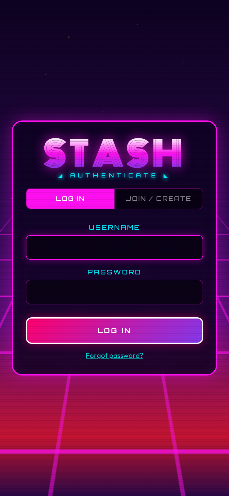
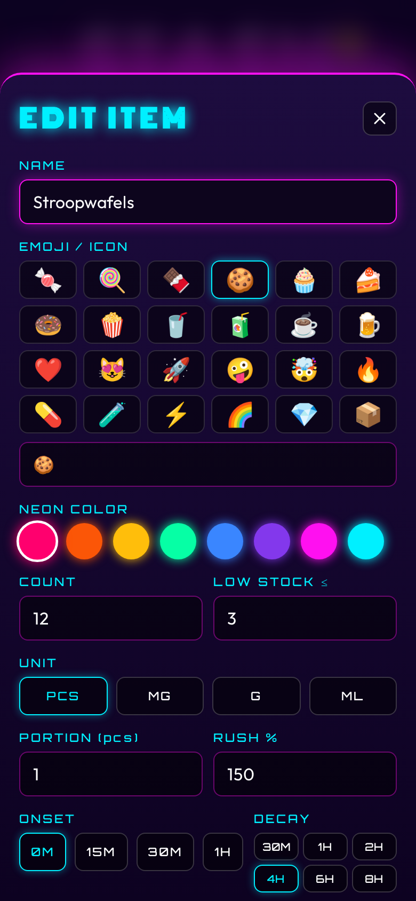
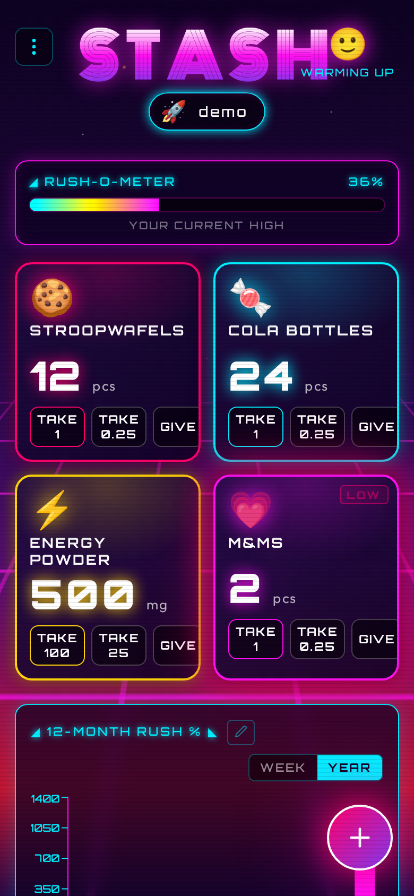
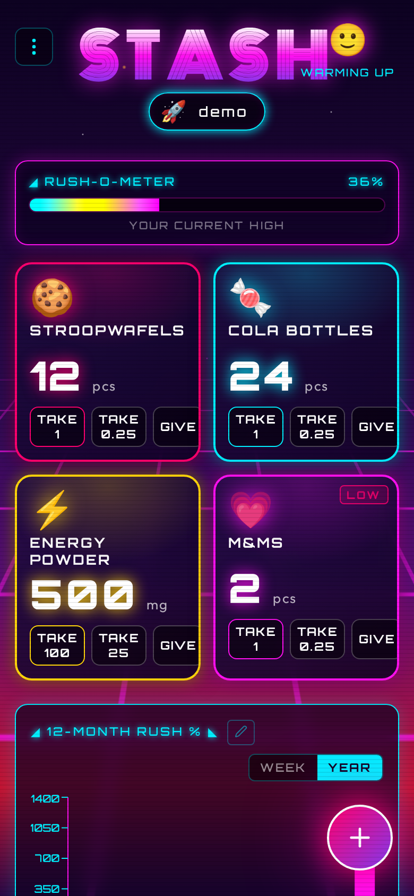
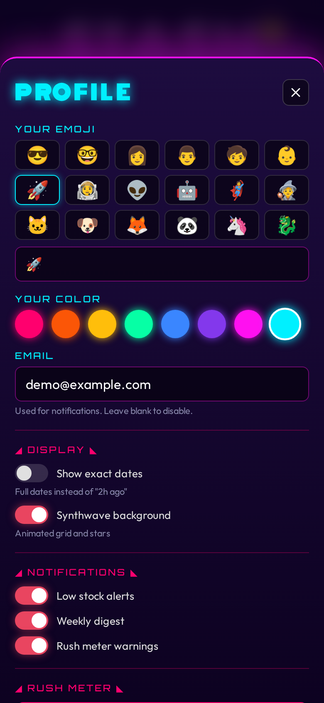
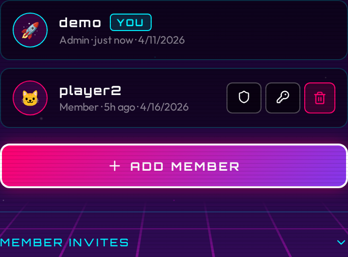
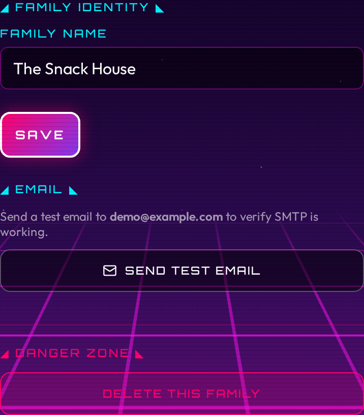
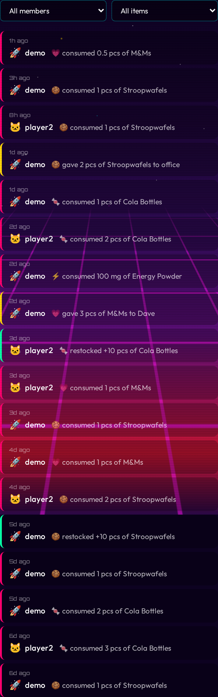
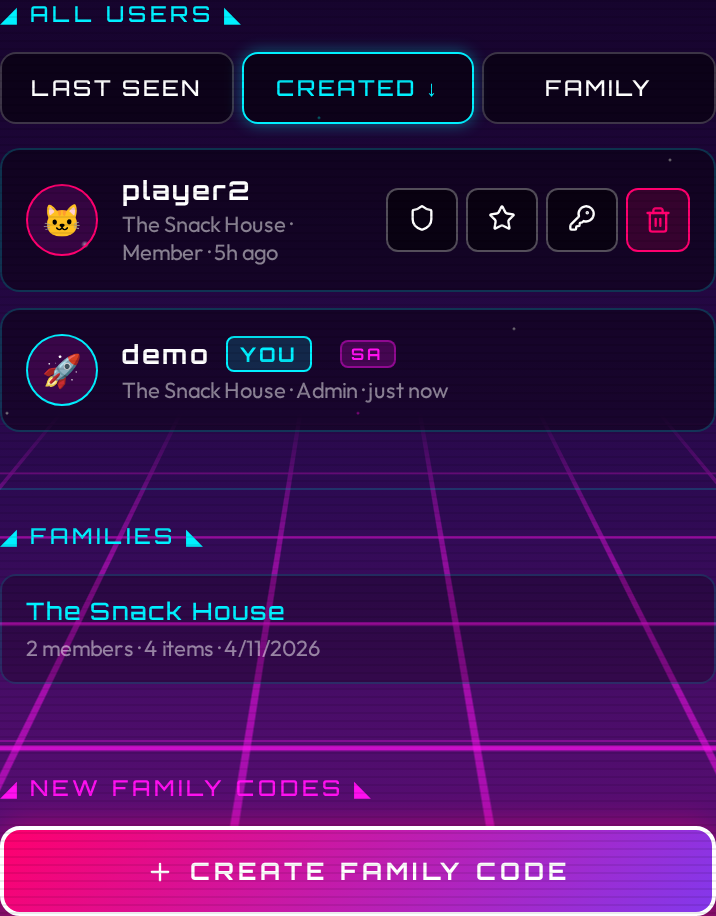

# Usage

## First login (bootstrap)

When you open Stash for the first time, a setup form appears. Fill it in:

- **Family name** - the name for your household's shared stash (e.g. "The Smiths", "Apartment 4B")
- **Username** - your personal login handle
- **Password** - at least 8 characters
- **Emoji** - an avatar for yourself (optional, defaults to 😎)

Submit the form. You land on the main inventory screen, logged in as admin. This form only appears once. After this, new members must be invited.

!!! info "You are the superadmin"
    The account created during bootstrap is the superadmin. This is a special role that spans all families on the instance. See [Superadmin](#superadmin) below for what that means.

## Inviting members

There are two types of invite codes:

- **Member invites**: invite someone into your own family. Any family admin can create these.
- **Family starter codes**: let someone create a brand-new family and become its admin. Only the superadmin can create these.

### Member invites

1. Open the menu (three dots, top right) and tap **FAMILY**.
2. In the admin panel, scroll to **MEMBER INVITES** and tap **Generate Invite**.
3. Choose how many uses the code allows (1, 5, or unlimited) and how long it stays valid (1 hour, 24 hours, or 7 days).
4. Copy the code and send it to your family member.

The family member opens Stash, sees the login/join screen, and enters the code in the **INVITE CODE** field. They pick a username and password. The **FAMILY NAME** field is ignored for member invites. They join your family automatically.

### Family starter codes

See [Superadmin](#superadmin) below.

!!! info "Invite codes are case-insensitive"
    Codes are displayed in uppercase but the registration form accepts any case.

## Adding items

Open the menu and tap the **+** button (or the plus icon in the header) to add an item.

Fill in the fields:

| Field | What it does |
|---|---|
| **Name** | What to call the item (e.g. "Tikkels", "Protein Powder") |
| **Emoji / Icon** | Pick from the presets or type your own |
| **Neon color** | Color for the card glow and accents |
| **Unit** | `pcs` (pieces), `mg`, `g`, or `ml` |
| **Starting count** | How many you have right now |
| **Low-stock threshold** | The count at which the card starts pulsing. Set to 0 to disable. |
| **Portion size** | How much one tap of TAKE removes. Defaults to 1 for `pcs`, 100 for `mg` and `g`, 250 for `ml`. |
| **Rush %** | How much this item contributes to the Rush-O-Meter relative to a standard portion. 100% is default. Set higher for stronger items, lower for milder ones. |
| **Decay** | How long until one portion's rush contribution fades to zero. Options: 30 min, 1 h, 2 h, 4 h, 6 h, 8 h. |
| **Onset** | How long after consumption before the rush contribution begins. Options: 0 min (immediate), 5 min, 10 min, 15 min, 30 min. Defaults to 0. |

Tap **SAVE** and the item appears on the inventory grid.

To edit an item, tap the pencil icon on its card.

To delete an item, open the edit form and tap **DELETE**. The item disappears from the inventory grid. Your consumption history for that item is kept: it still counts toward your rush meter and shows up in your charts and the admin activity feed.

## Taking items

Each item card has three action buttons:

- **TAKE** - removes one full portion (whatever `portion_size` is set to)
- **±¼** - removes one quarter of a portion
- **GIVE** - give items to someone outside the household

Long-pressing either button removes ten portions at once (useful for restocking in reverse, or tracking a big session).

To add stock (restock), use the **+** button on the card. Long-press **+** to add ten at once.

The count on screen updates immediately. If the request fails, the count snaps back.

!!! tip "Quarter doses"
    The ±¼ button is useful for items you consume in fractions (half a gummy, a small sip of a drink). The quarter step is `portion_size ÷ 4`.

### Giving items away

Tap **GIVE** on an item card to record giving snacks to someone outside the household. A small dialog asks for the amount and an optional recipient name (e.g. "Dave", "office"). Give-aways reduce the item count but do not affect your rush meter or chart. They appear in your history with a yellow border, and in the weekly digest under a separate "SHARED" section.

## Rush-O-Meter

The Rush-O-Meter is a bar at the top of the inventory screen. It shows how much you have consumed recently, expressed as a percentage.

### How it works

Every time you take an item, the server logs the consumption with a timestamp and captures the item's current rush settings (rush factor, portion size, onset, and decay). The Rush-O-Meter replays those log entries using the captured settings and calculates a rolling score. Each portion's contribution decays linearly to zero over the item's decay window. If an item has an onset delay, its contribution is ignored until that delay has passed. The meter ticks down on its own as time passes.

The math:

- **Rush score** = sum over recent consumptions of `(rush_factor x portions_consumed x (1 - effective_age / decay_window))`, where `effective_age = max(0, age - onset_delay)`. Entries still within their onset window are not counted.
- **Rush %** = `rush_score × 100`

A single standard portion (rush factor 1.0, decay 4 hours) at the moment of consumption = 100%.

### Mascot tiers

The mascot emoji in the header reflects your current rush level:

| Rush % | Mascot | Label |
|---|---|---|
| 0–25 | 😴 | CHILL |
| 25–50 | 🙂 | WARMING UP |
| 50–75 | 😄 | HYPED |
| 75–150 | 🤪 | FULL RAVE |
| 150–250 | 🤯 | OVERDRIVE |
| 250+ | 💀 | COMA |

### Per-item rush configuration

You control two settings per item:

- **Rush %**: scales the contribution of each portion. 200% means one portion counts as two standard portions toward the meter. 50% means half. Range: 10%–1000%.
- **Decay**: how long before that portion's contribution fades. Shorter decay = faster recovery.
- **Onset**: adds a delay before each portion starts contributing to the meter. Use this for items that take time to kick in. A candy might be immediate (0 min); caffeine might take 15 minutes.

These settings let you model the real-world difference between, say, a piece of dark chocolate (high rush, fast decay) and a cup of tea (low rush, slow decay).

Changing these settings only affects future consumption. Past chart entries and rush calculations keep the values that were in effect when you actually took the item.

### Resetting the meter

If you want to clear your rush history without deleting consumption data, tap the Rush-O-Meter bar. A reset button appears. Tapping it sets a "reset timestamp": log entries before that timestamp are ignored when calculating your current rush level. Your charts are not affected.

## Charts

Below the item grid, you see a bar chart of rush units consumed over time. Use the **WEEK** / **YEAR** toggle to switch views:

- **WEEK** - past 7 days, one bar per day
- **YEAR** - past 12 months, one bar per month

The chart shows your own consumption only; each person's chart is private to their account.

### Editing history

Tap the pencil icon next to the chart title to open the history editor. This shows a scrollable list of all your consumption and restocking entries, most recent first.

You can:

- **Add an entry** you forgot to log. Tap ADD, pick the item, choose consumed or restocked, enter the amount, set the date and time, and save. The entry appears in your chart and rush meter as if you had logged it at that time. Adding an entry does not change the item's current stock count.
- **Edit an entry** to fix the amount or timestamp. Tap the pencil icon next to any entry.
- **Delete an entry** that was logged by mistake. Tap the trash icon, then confirm.

Changes take effect immediately: the chart and rush meter update as soon as you save.

### Clearing chart history

To clear all your consumption history from the charts:

1. Open your profile settings.
2. Scroll to the **RUSH METER** section.
3. Tap **CLEAR CHART HISTORY** and confirm.

This permanently deletes all your consumption log entries. Your rush meter resets to zero and your charts become empty. Other family members' data is not affected. Item counts are not changed.

## Low-stock alerts

When an item's count drops to or below its **threshold**, the card starts pulsing with a neon-pink glow. This is a visual reminder to restock.

To configure:

1. Tap the pencil icon on the item card.
2. Set the **Low-stock threshold** field to the count at which you want the alert.
3. Save.

Set the threshold to `0` to disable alerts for that item.

## Profile settings

Tap your name pill in the top-right corner (or go to menu → PROFILE) to open your profile settings.

You can change:

- **Emoji** - your avatar shown in the header pill
- **Color** - the neon color associated with your account
- **Email** - optional. Required to receive email notifications and to use password reset.

Your username cannot be changed after registration. To change your password, see below.

### Display preferences

- **Show exact dates**: replaces relative timestamps ("2h ago") with full dates. Affects the inventory history, admin activity feed, and user lists.
- **Synthwave background**: toggles the animated grid, stars, and scanlines behind the main interface. Enabled by default.

## Notifications

Stash can send email notifications when certain events happen. Notifications require SMTP to be configured (see [Configuration](configuration.md)) and an email address on your account.

### Enabling notifications

1. Set your email address in your profile settings.
2. Open your profile settings and scroll to the **NOTIFICATIONS** section.
3. Toggle on the notifications you want:
   - **Low stock alerts**: sends an email when an item drops to or below its threshold after someone takes one. Sent to all opted-in family members, not just the person who took the item. Rate-limited to one alert per item every 6 hours.
   - **Weekly digest**: a Monday morning summary of the week's consumption. Includes top consumed items with a per-user breakdown, items currently below threshold, and peak snack day.
   - **Rush meter warnings**: sends you an email when your personal rush meter crosses 80%. Rate-limited to one warning every 4 hours.

Notifications are per-user. Each person chooses which types they want. If SMTP is not configured on the server, the toggle section still appears but emails are silently skipped.

### Password reset

If you forget your password:

1. Open the login screen and tap **Forgot password?**
2. Enter your username and tap **SEND RESET LINK**.
3. Check your email for a message from Stash with a reset link.
4. Click the link, enter a new password, and confirm.

The reset link expires after 1 hour. If the link has expired, request a new one.

Password reset requires an email address on your account. If you never set one, ask a family admin to delete your account and re-create it, or to set an email for you.

## Admin panel

Open the menu and tap **FAMILY** (visible only to admins) to open the admin area. The admin area is a full-screen view with four tabs: **Users**, **Settings**, **Activity**, and **System** (superadmin only).

### Users tab

The Users tab lists every member of your family. Each entry shows the member's emoji, username, role badge (Admin or Member), last login time, and the date their account was created.

For each member you can:

- Promote or demote admin status (shield icon)
- Reset their password (key icon)
- Delete their account (trash icon, requires confirmation)

You cannot delete your own account.

To create a new account directly without an invite code:

1. Fill in the **Create User** form at the bottom of the tab.
2. Enter a username, password, email (optional), emoji, and whether the account should be an admin.
3. Tap **Create**.

**Invite codes** are in a collapsible section on the Users tab. Tap it to expand the list of active member invite codes. Each code shows the code itself (tap the copy icon to copy it), how many uses remain, and when it expires. Tap the trash icon to revoke a code early.

To generate a new member invite:

1. Expand the invite codes section and tap **Generate Invite**.
2. Choose max uses: `1`, `5`, or `∞` (unlimited).
3. Choose expiry: `1h`, `24h`, or `7d`.
4. Copy the code and share it with the person joining.

### Settings tab

The Settings tab lets you rename your family. Type a new name and save.

The Settings tab also contains a **Danger Zone** section, visible only to the superadmin, for deleting the family. Deletion requires typing the family name to confirm.

### Activity tab

The Activity tab shows a chronological feed of what your family has been eating and restocking. Each entry shows the timestamp, the user (emoji and name), the item (emoji and name), and the action (consumed or restocked, with the amount). If an item has been deleted, its entries remain in the feed with a "(removed)" label.

Use the two dropdown filters to narrow the feed by user or by item. Tap **Load More** at the bottom to page through older entries.

## Superadmin

The account created during the initial bootstrap is the superadmin. The superadmin can do everything a regular family admin can do, plus manage the entire instance across all families.

There is no open registration. The only way to start a new family is for the superadmin to generate a family starter code.

### System tab

The System tab is visible only to the superadmin. It has three sections:

- **Global user list**: all users across all families, sortable by last seen, created date, or family. You can toggle admin status, toggle superadmin status, reset a password, or delete any user from here.
- **Family overview**: cards for every family on the instance, showing the family name, member count, and item count.
- **Family starter codes**: create and revoke the codes that let new users set up their own families. Each code shows the code itself, remaining uses, and expiry.

### Creating a family starter code

1. Log in as the superadmin.
2. Open the menu and tap **FAMILY**.
3. Go to the **System** tab.
4. In the **Family Starter Codes** section, tap **Generate Code**, choose max uses and expiry, and copy the code.
5. Send the code to the person who will run the new family.

### How the recipient uses it

The recipient opens Stash, goes to the join screen, and:

1. Enters the family starter code in the **INVITE CODE** field.
2. Fills in a **FAMILY NAME** for their new family.
3. Picks a username and password.

Their account is created, a new family is created with the name they chose, and they become that family's admin. They can then generate their own member invites to add people to their family.

!!! warning "Family name is required for starter codes"
    If someone uses a family starter code without filling in a family name, registration will fail. Let them know to fill in both fields.

## Changing your password

Open the menu and tap **PASSWORD**.

Enter your current password, then your new password (minimum 8 characters). Tap **Change Password**.

Changing your password invalidates all your other sessions, so any other browser or device logged in as you will be signed out.
